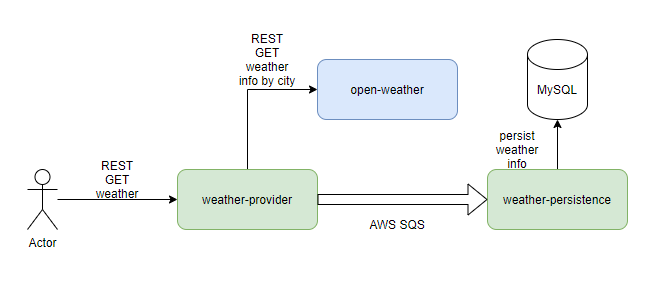

# weather-provider

### **Architecture**

Setup:

`docker build . -t weather-provider`

`docker run -p 8090:8090 --name weather-provider -d weather-provider`

The API can be accessed through the Swagger UI located at localhost:8090/swagger-ui.html
